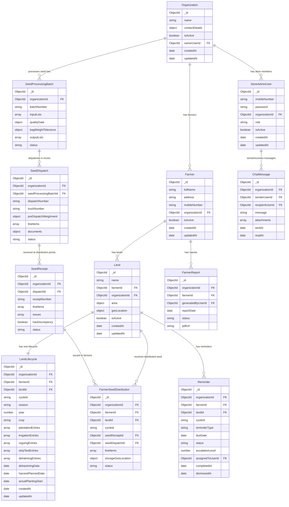

# Contract farming — data model & RBAC

This document describes how **organizations**, **store users**, **farmers**, **lands**, **land lifecycle tracking**, **reminders**, **farmer reports**, and **chat messages** are modeled in MongoDB (via Mongoose).

## Project context

- **Stack**: [Next.js](https://nextjs.org/) (App Router), React, TypeScript, [Mongoose](https://mongoosejs.com/) for MongoDB.
- **Location**: model definitions live under `models/`.
- **Pattern**: models use the Next.js-friendly `models.X || model(...)` export so the schema is not re-registered on hot reload in development.

## High-level design

The app is **multi-tenant**: all business data is scoped to an **organization**. Store users, farmers, lands, seed processing, dispatch, receipt, farmer seed distribution, lifecycle events, reminders, report metadata, and chat messages are all tenant-scoped through `organizationId`.

- **Tenant boundary**: `organizationId` is present on all operational models and should always be used in query filters.
- **RBAC**: `StoreAdminUser.role` is one of the values defined in `models/rbac.ts` (enforced by Mongoose `enum` on the store user schema).

---

## Organization

**File**: `models/Organization.ts`  
**Interface**: `IOrganization`

| Field                     | Type                  | Purpose                                                                                                                                                                                             |
| ------------------------- | --------------------- | --------------------------------------------------------------------------------------------------------------------------------------------------------------------------------------------------- |
| `_id`                     | `ObjectId`            | Primary key.                                                                                                                                                                                        |
| `name`                    | `string`              | Display name (e.g. company name). Required, trimmed.                                                                                                                                                |
| `contactDetails`          | embedded object       | Optional `phone`, `email`, `address`. Stored as a subdocument without its own `_id`. Defaults to `{}`.                                                                                              |
| `isActive`                | `boolean`             | Tenant-level kill switch; default `true`.                                                                                                                                                           |
| `ownerUserId`             | `ObjectId` (optional) | Reference to a `StoreAdminUser` who is treated as the primary owner/admin contact. Optional until onboarding sets it. **Authorization** still relies on `StoreAdminUser.role`, not only this field. |
| `createdAt` / `updatedAt` | `Date`                | Maintained by Mongoose `timestamps: true`.                                                                                                                                                          |

**Indexes**: `ownerUserId` is indexed for lookups; `name` is not uniquely constrained in the schema (add a unique index if slugs or global uniqueness are required later).

---

## Store Admin User (Organization member)

**File**: `models/User.ts`  
**Interface**: `IStoreAdminUser`

`models/User.ts` exports `StoreAdminUser` as the canonical model name and also provides `User` as a backward-compatible alias for older imports.

| Field                     | Type       | Purpose                                                                                                                 |
| ------------------------- | ---------- | ----------------------------------------------------------------------------------------------------------------------- |
| `_id`                     | `ObjectId` | Primary key.                                                                                                            |
| `mobileNumber`            | `string`   | Login identifier **within** the organization. Required, trimmed.                                                        |
| `password`                | `string`   | Stored hashed (bcrypt) via a `pre('save')` hook when the password changes.                                              |
| `organizationId`          | `ObjectId` | Required reference to `Organization`. Indexed.                                                                          |
| `role`                    | `string`   | One of `ORGANIZATION_ROLES` (see below). Indexed.                                                                       |
| `isActive`                | `boolean`  | User-level access; default `true`. Should be checked on every authenticated request together with org-level `isActive`. |
| `createdAt` / `updatedAt` | `Date`     | Mongoose timestamps.                                                                                                    |

**Unique constraint**: compound index on `{ organizationId: 1, mobileNumber: 1 }` (unique). The same mobile number may appear in **different** organizations; it cannot appear twice in the **same** organization.

**Password hashing**: on `save`, if `password` was modified, it is replaced with a bcrypt hash before persistence.

---

## Farmer

**File**: `models/Farmer.ts`  
**Interface**: `IFarmer`

| Field                     | Type       | Purpose                                                       |
| ------------------------- | ---------- | ------------------------------------------------------------- |
| `_id`                     | `ObjectId` | Primary key.                                                  |
| `fullName`                | `string`   | Farmer name. Required, trimmed.                               |
| `address`                 | `string`   | Farmer address. Required, trimmed.                            |
| `mobileNumber`            | `string`   | Farmer contact number within tenant scope. Required, trimmed. |
| `organizationId`          | `ObjectId` | Required reference to `Organization`. Indexed.                |
| `isActive`                | `boolean`  | Farmer-level active/inactive state.                           |
| `createdAt` / `updatedAt` | `Date`     | Mongoose timestamps.                                          |

**Unique constraint**: compound index on `{ organizationId: 1, mobileNumber: 1 }` (unique).

---

## Land

**File**: `models/Land.ts`  
**Interface**: `ILand`

Each farmer can have multiple lands.

| Field                     | Type                       | Purpose                                                           |
| ------------------------- | -------------------------- | ----------------------------------------------------------------- |
| `_id`                     | `ObjectId`                 | Primary key.                                                      |
| `name`                    | `string`                   | Land name. Required, trimmed.                                     |
| `farmerId`                | `ObjectId`                 | Required reference to `Farmer`. Indexed.                          |
| `organizationId`          | `ObjectId`                 | Required reference to `Organization`. Indexed.                    |
| `area.value`              | `number`                   | Area value (`>= 0`).                                              |
| `area.unit`               | `string`                   | One of `acre` or `hectare`.                                       |
| `geoLocation`             | embedded object (optional) | Optional `latitude` / `longitude` for future geospatial features. |
| `isActive`                | `boolean`                  | Land-level active/inactive state.                                 |
| `createdAt` / `updatedAt` | `Date`                     | Mongoose timestamps.                                              |

**Unique constraint**: `{ organizationId: 1, farmerId: 1, name: 1 }`.

---

## Land Lifecycle

**File**: `models/LandLifecycle.ts`  
**Interface**: `ILandLifecycle`

Tracks the full lifecycle for one land.  
One `LandLifecycle` document maps to one `Land` (`landId` unique).

| Field                                                         | Type                         | Purpose                                                                                                                                                            |
| ------------------------------------------------------------- | ---------------------------- | ------------------------------------------------------------------------------------------------------------------------------------------------------------------ |
| `organizationId`                                              | `ObjectId`                   | Tenant scope.                                                                                                                                                      |
| `farmerId`                                                    | `ObjectId`                   | Link to farmer owning the land.                                                                                                                                    |
| `landId`                                                      | `ObjectId`                   | Unique link to `Land`.                                                                                                                                             |
| `cycleId`                                                     | `string`                     | Optional lifecycle/crop cycle identifier (for backward compatibility).                                                                                             |
| `season`, `year`, `crop`                                      | `string`, `number`, `string` | Cycle metadata used to group monitoring and reporting by crop season.                                                                                              |
| `plannedPlantingWindow`                                       | embedded object              | Optional `startDate`/`endDate` planning window.                                                                                                                    |
| `actualPlantingStart`, `dehaulmingDate`, `harvestPlannedDate` | `Date`                       | Anchor dates for crop monitoring and harvest planning.                                                                                                             |
| `plantationEntries[]`                                         | array                        | Plantation date, variety, size, quantity, basal fertilizer, pre-irrigation, field geolocation, planting depth/spacing/pattern, bags used, notes, recorded-by user. |
| `irrigationEntries[]`                                         | array                        | Irrigation date, notes, photos/videos, optional admin/manager instructions, review metadata.                                                                       |
| `roguingEntries[]`                                            | array                        | Roguing date, observations, virus-infected and mixed-variety counts, germination percentage, quality assessment report reference.                                  |
| `stripTestEntries[]`                                          | array                        | Strip-test measurements (length/area, tuber counts and weight, ratio) with dehaulming-readiness decision fields.                                                   |
| `dehalmingEntries[]`                                          | array                        | Dehalming date, notes, recorded-by user.                                                                                                                           |

This model captures PRD planting-through-harvest checkpoints (planting details, irrigation, roguing quality, strip-test maturity assessment, dehaulming, and harvest planning).

---

## Seed Processing Batch

**File**: `models/SeedProcessingBatch.ts`  
**Interface**: `ISeedProcessingBatch`

Tracks seed retrieval and preparation workflows before dispatch.

| Field                                    | Type            | Purpose                                                                              |
| ---------------------------------------- | --------------- | ------------------------------------------------------------------------------------ |
| `organizationId`                         | `ObjectId`      | Tenant scope.                                                                        |
| `batchNumber`                            | `string`        | Organization-scoped unique batch identifier.                                         |
| `sourceColdStorageName`                  | `string`        | Optional source location for retrieved seed bags.                                    |
| `inputLots[]`                            | array           | Lot-wise input (`lotNumber`, variety, size, bag count, total weight).                |
| `sortingNotes`                           | `string`        | Notes from sorting and defect removal stage.                                         |
| `treatmentChemicalVolumeMl`              | `number`        | Treatment chemical usage record.                                                     |
| `treatmentAppliedAt`, `treatmentDriedAt` | `Date`          | Treatment and post-treatment drying checkpoints.                                     |
| `qualityGate`                            | embedded object | Decision (`accepted`, `resort`, `rejected`) + reason/issue report + actor/timestamp. |
| `bagWeightTolerance`                     | embedded object | Target/min/max bag weight thresholds for packing QC.                                 |
| `outputLots[]`                           | array           | Prepared output lots ready for dispatch.                                             |
| `status`                                 | `string`        | `draft`, `processing`, `quality_hold`, `packed`, `ready_for_dispatch`.               |

**Indexes**: unique `{ organizationId, batchNumber }`, plus `{ organizationId, status, createdAt }`.

---

## Seed Dispatch

**File**: `models/SeedDispatch.ts`  
**Interface**: `ISeedDispatch`

Tracks dispatch, truck assignment, and transport documentation.

| Field                                   | Type            | Purpose                                                                      |
| --------------------------------------- | --------------- | ---------------------------------------------------------------------------- |
| `organizationId`                        | `ObjectId`      | Tenant scope.                                                                |
| `seedProcessingBatchId`                 | `ObjectId`      | Optional link to source processing batch.                                    |
| `dispatchNumber`                        | `string`        | Organization-scoped unique dispatch identifier.                              |
| `truckNumber`                           | `string`        | Assigned vehicle number.                                                     |
| `driverName`, `driverMobileNumber`      | `string`        | Driver contact details.                                                      |
| `originLocation`, `destinationLocation` | `string`        | Dispatch route metadata.                                                     |
| `preDispatchWeighment`                  | embedded object | Tare/gross/net weights and measurement timestamp.                            |
| `documents`                             | embedded object | `dispatchSlipUrl`, `weightSlipUrl`.                                          |
| `lineItems[]`                           | array           | Lot-wise material dispatched (variety/size/bags/net weight).                 |
| `status`                                | `string`        | `draft`, `ready_to_load`, `loaded`, `dispatched`, `in_transit`, `delivered`. |

**Indexes**: unique `{ organizationId, dispatchNumber }`, plus `{ organizationId, status, createdAt }`.

---

## Seed Receipt

**File**: `models/SeedReceipt.ts`  
**Interface**: `ISeedReceipt`

Tracks receipt verification at the distribution point.

| Field                                  | Type       | Purpose                                                               |
| -------------------------------------- | ---------- | --------------------------------------------------------------------- |
| `organizationId`                       | `ObjectId` | Tenant scope.                                                         |
| `dispatchId`                           | `ObjectId` | Required reference to dispatch record.                                |
| `receiptNumber`                        | `string`   | Organization-scoped unique receipt identifier.                        |
| `receiverName`, `receiverMobileNumber` | `string`   | Receiver details for acknowledgement.                                 |
| `receivedAt`, `acknowledgedAt`         | `Date`     | Receipt and acknowledgement timestamps.                               |
| `hasDiscrepancy`                       | `boolean`  | Quick flag for damaged/mismatched consignments.                       |
| `issues[]`                             | array      | Structured discrepancy log (type, description, actor, timestamp).     |
| `lineItems[]`                          | array      | Received lot-wise counts/weights and stack location labels.           |
| `status`                               | `string`   | `pending_verification`, `verified`, `discrepancy_reported`, `closed`. |

**Indexes**: unique `{ organizationId, receiptNumber }`, plus `{ organizationId, status, createdAt }`.

---

## Farmer Seed Distribution

**File**: `models/FarmerSeedDistribution.ts`  
**Interface**: `IFarmerSeedDistribution`

Tracks seed issue to farmers as an explicit acknowledgement artifact.

| Field                             | Type            | Purpose                                                           |
| --------------------------------- | --------------- | ----------------------------------------------------------------- |
| `organizationId`                  | `ObjectId`      | Tenant scope.                                                     |
| `farmerId`, `landId`              | `ObjectId`      | Target farmer and land receiving seed.                            |
| `cycleId`                         | `string`        | Required cycle link to reconcile planting and monitoring records. |
| `seedReceiptId`, `seedDispatchId` | `ObjectId`      | Optional upstream references for traceability.                    |
| `issueDate`                       | `Date`          | Seed distribution date.                                           |
| `lineItems[]`                     | array           | Lot-wise issue details (bags and weight).                         |
| `storageGeoLocation`              | embedded object | Farmer storage latitude/longitude.                                |
| `farmerAcknowledgedAt`            | `Date`          | Farmer receipt acknowledgement timestamp.                         |
| `status`                          | `string`        | `issued`, `acknowledged`, `disputed`.                             |
| `issuedByUserId`                  | `ObjectId`      | User who issued seed to farmer.                                   |

**Indexes**: `{ organizationId, cycleId, landId, issueDate }`, `{ organizationId, status, createdAt }`.

---

## Reminder

**File**: `models/Reminder.ts`  
**Interface**: `IReminder`

Stores generated reminder events tied to land lifecycle timing.

| Field                         | Type       | Purpose                                                                                                                                                                            |
| ----------------------------- | ---------- | ---------------------------------------------------------------------------------------------------------------------------------------------------------------------------------- |
| `organizationId`              | `ObjectId` | Tenant scope.                                                                                                                                                                      |
| `farmerId`                    | `ObjectId` | Farmer target.                                                                                                                                                                     |
| `landId`                      | `ObjectId` | Land target.                                                                                                                                                                       |
| `cycleId`                     | `string`   | Optional cycle link for cycle-aware reminder filtering.                                                                                                                            |
| `reminderType`                | `string`   | `first_visit`, `roguing`, `strip_test`, `final_follow_up`, `seed_prep_qc_hold`, `dispatch_follow_up`, `receipt_discrepancy_closure`, `dehaulming_readiness`, `harvest_scheduling`. |
| `dueDate`                     | `Date`     | Reminder due timestamp.                                                                                                                                                            |
| `status`                      | `string`   | `pending`, `completed`, or `dismissed`.                                                                                                                                            |
| `escalationLevel`             | `number`   | Optional escalation depth for unresolved events.                                                                                                                                   |
| `assignedToUserId`            | `ObjectId` | Optional owner of reminder action.                                                                                                                                                 |
| `completedAt` / `dismissedAt` | `Date`     | Optional completion or dismissal audit fields.                                                                                                                                     |
| `notes`                       | `string`   | Optional notes.                                                                                                                                                                    |

**Unique constraint**: `{ organizationId, landId, reminderType, dueDate }`.
**Operational index**: `{ organizationId, cycleId, status, dueDate }`.

---

## Farmer Report

**File**: `models/FarmerReport.ts`  
**Interface**: `IFarmerReport`

Stores metadata for generated farmer PDF reports.

| Field               | Type       | Purpose                                         |
| ------------------- | ---------- | ----------------------------------------------- |
| `organizationId`    | `ObjectId` | Tenant scope.                                   |
| `farmerId`          | `ObjectId` | Farmer whose report is generated.               |
| `generatedByUserId` | `ObjectId` | Optional actor who triggered report generation. |
| `reportDate`        | `Date`     | Generation/report timestamp.                    |
| `status`            | `string`   | `draft`, `generated`, or `failed`.              |
| `pdfUrl`            | `string`   | Optional output file location.                  |
| `errorMessage`      | `string`   | Optional failure reason.                        |

---

## Chat Message

**File**: `models/ChatMessage.ts`  
**Interface**: `IChatMessage`

Basic communication between organization users (e.g. admin/manager/staff).

| Field             | Type       | Purpose                                                     |
| ----------------- | ---------- | ----------------------------------------------------------- |
| `organizationId`  | `ObjectId` | Tenant scope.                                               |
| `senderUserId`    | `ObjectId` | Sender (`StoreAdminUser`).                                  |
| `recipientUserId` | `ObjectId` | Recipient (`StoreAdminUser`).                               |
| `message`         | `string`   | Message body.                                               |
| `attachments[]`   | array      | Optional media/file attachments (`image`, `video`, `file`). |
| `sentAt`          | `Date`     | Sent time.                                                  |
| `readAt`          | `Date`     | Optional read time.                                         |

---

## Roles (RBAC)

**File**: `models/rbac.ts`

| Constant                    | Type alias             | Notes                                                  |
| --------------------------- | ---------------------- | ------------------------------------------------------ |
| `ORGANIZATION_ROLES`        | `readonly` tuple       | Source of truth for allowed role strings.              |
| `OrganizationRole`          | union of those strings | Use in TypeScript for type-safe handlers.              |
| `isOrganizationRole(value)` | type guard             | Safe parsing of untrusted strings (e.g. query params). |

Current roles (intended hierarchy is product-defined; extend in `rbac.ts` and keep the store user schema `enum` in sync):

| Role      | Typical use                                            |
| --------- | ------------------------------------------------------ |
| `admin`   | Full administration of the organization and its users. |
| `manager` | Operational management below full admin.               |
| `staff`   | Day-to-day operations with limited scope.              |

**Important**: roles are **per organization**. Store membership is represented by the store user document (`organizationId` + `role`).

Fine-grained permissions (e.g. “can edit contracts”) are **not** stored in MongoDB here; implement them in application code by mapping `OrganizationRole` → allowed actions, or introduce a separate permissions layer later if needed.

---

## Cross-cutting rules for APIs and sessions

When implementing routes or session payloads, a consistent checklist is:

1. Resolve the authenticated store user and load `organizationId`, `role`, `isActive`.
2. Reject if `StoreAdminUser.isActive` is false.
3. Load `Organization` and reject if missing or `Organization.isActive` is false.
4. For tenant-scoped resources, ensure `resource.organizationId` equals the user’s `organizationId` (unless building a true platform-admin role later, which would require schema changes).

---

## Bootstrap and `ownerUserId`

Creating an organization and the first user often implies a chicken-and-egg problem (`organizationId` is required on the user; `ownerUserId` is optional on the org). A typical flow:

1. Create `Organization` without `ownerUserId`.
2. Create the first store user with `organizationId` set and `role: "admin"`.
3. Update `Organization.ownerUserId` to that user’s `_id`.

Keep transactional consistency in mind (MongoDB transactions or careful ordering) if both writes must succeed or fail together.

---

## Related files

| Path                               | Role                                                                                                  |
| ---------------------------------- | ----------------------------------------------------------------------------------------------------- |
| `models/Organization.ts`           | Organization schema and `IOrganization`.                                                              |
| `models/User.ts`                   | Store admin user schema, password hook, compound unique index.                                        |
| `models/Farmer.ts`                 | Farmer schema and org membership.                                                                     |
| `models/Land.ts`                   | Land schema linked to farmer + organization.                                                          |
| `models/LandLifecycle.ts`          | Cycle-aware land lifecycle tracking (planting, monitoring, strip test, dehaulming, harvest planning). |
| `models/SeedProcessingBatch.ts`    | Seed retrieval, sorting, treatment, QC decision, and packing output records.                          |
| `models/SeedDispatch.ts`           | Dispatch loading, truck weighment, transport docs, and line items.                                    |
| `models/SeedReceipt.ts`            | Distribution-point receipt verification and discrepancy tracking.                                     |
| `models/FarmerSeedDistribution.ts` | Farmer-level seed issue acknowledgement with storage geolocation.                                     |
| `models/Reminder.ts`               | Reminder events and status tracking.                                                                  |
| `models/FarmerReport.ts`           | Farmer report generation metadata.                                                                    |
| `models/ChatMessage.ts`            | Intra-org chat message records.                                                                       |
| `models/rbac.ts`                   | Role constants, types, and `isOrganizationRole`.                                                      |

---

## Evolving the model

- **Multiple orgs per user**: introduce a `Membership` (or `OrganizationMember`) collection with `userId`, `organizationId`, `role`, and adjust login to choose “current org” or store active org on the session.
- **Platform super-admins**: add a flag or role that bypasses org scope only where explicitly allowed.
- **Permissions table**: store allowed actions per role in code or in DB if non-developers must edit them.

## Migration strategy

- Existing `LandLifecycle` documents remain valid because new cycle fields (`cycleId`, season/year/crop, planning dates) are optional.
- Existing `visitReports`-style data should be mapped to `stripTestEntries` in a backfill script before UI endpoints fully switch to the new field.
- Reminder documents without `cycleId` continue to work; new APIs should attach `cycleId` when available to support cycle-scoped dashboards.
- New supply-chain models (`SeedProcessingBatch`, `SeedDispatch`, `SeedReceipt`, `FarmerSeedDistribution`) are additive and do not break existing farmer/land flows.

This document should be updated whenever model interfaces, enums, indexes, or relationships change materially.
